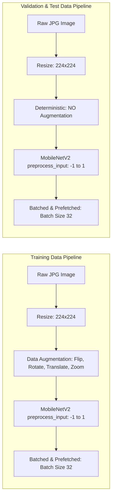
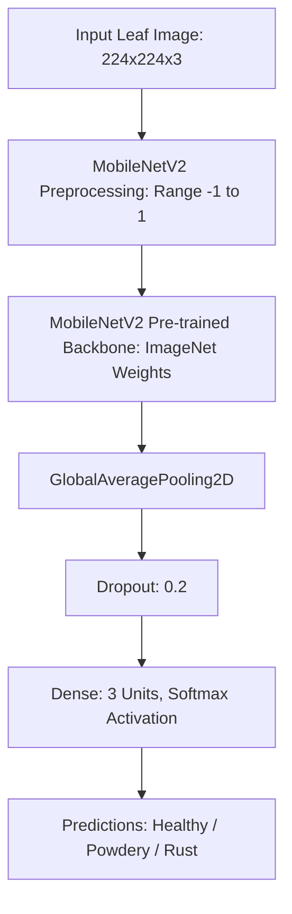
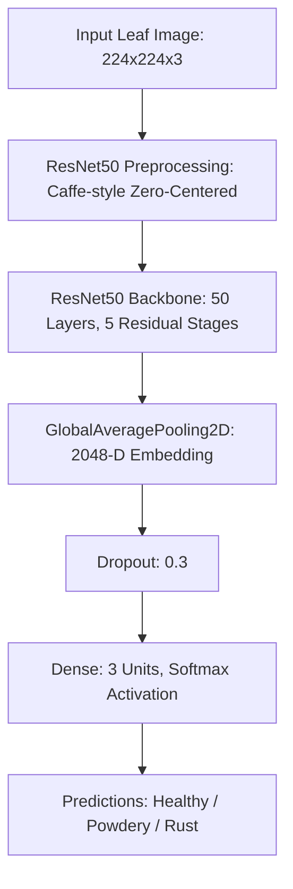

# Comparative Analysis of Deep Learning Architectures for Plant Disease Classification Using Leaf Images

> **Short Name:** Plant Disease Recognition Using Deep Learning  
> **Project Type:** Supervised Image Classification  
> **Target Classes:** `Healthy`, `Powdery` (Powdery Mildew), `Rust` (Leaf Rust)  
> **Status:** In Active Development (Preprocessing, MobileNetV2 Pipeline, ResNet50 Pipeline, Evaluations & Streamlit UI Completed)

---

## 1. Project Overview & Research Objective

### Research Question
> *"Which deep-learning architecture provides the best balance between classification performance, generalization, and computational efficiency for plant disease recognition?"*

### Project Description
This university research project investigates the automated identification and classification of foliar plant diseases from RGB leaf images using supervised deep learning. Foliar diseases—specifically powdery mildew and fungal leaf rust—pose severe threats to agricultural yield, crop health, and global food security. Early, automated detection via computer vision provides an accessible, non-destructive diagnostic mechanism for agricultural monitoring and intervention.

To evaluate architectural tradeoffs systematically, the project conducts a controlled empirical comparison of four distinct convolutional neural network paradigms:
1. **Custom CNN:** Constructed from scratch as an empirical architectural baseline (no pre-trained weights).
2. **MobileNetV2:** Lightweight depthwise-separable convolutional network via transfer learning for edge/mobile efficiency.
3. **ResNet50:** Deep residual network utilizing identity shortcut connections to evaluate representational depth.
4. **EfficientNetB0:** Compound-scaled network balancing depth, width, and resolution for optimal parameter efficiency.

All models target three distinct diagnostic categories:
- **Healthy:** Leaves exhibiting no visible pathogenic infection.
- **Powdery:** Leaves infected with powdery mildew fungal pathology.
- **Rust:** Leaves exhibiting fungal leaf rust pustules and chlorotic lesions.

The ultimate application deliverable is an interactive inference tool allowing users to upload a leaf photograph and receive real-time class predictions alongside confidence scores and complete probability distributions.

---

## 2. University Research Integrity & Scope Boundaries

To maintain rigorous scientific standards, the following guidelines govern all project reporting:
- **Zero Fabrication Policy:** No metrics, URLs, licenses, dataset provenance, or model outcomes are assumed or invented.
- **Strict Role Boundaries:** Each member has distinct architectural and pipeline responsibilities. Unfinished or unassigned components are explicitly identified as *In Progress* or *Planned*.
- **Clear Status Distinction:**
  - **Completed Work:** Data auditing, standardized preprocessing pipelines, MobileNetV2 baseline and fine-tuning experiments (Member 2), ResNet50 baseline and fine-tuning experiments (Member 3), final test evaluations for MobileNetV2 and ResNet50, confusion matrices, detailed error analyses, and local Streamlit inference applications.
  - **Ongoing / Planned Work:** Custom CNN (Member 1), EfficientNetB0 (Member 4), and final cross-architecture benchmark synthesis.
- **Unverified Attributes:** If external attributes (such as exact Kaggle source URLs or specific dataset licensing) lack direct repository proof, they are explicitly marked as *“Not yet verified”* or *“To be completed by the team.”*

---

## 3. Team Structure & Individual Responsibilities

The project workload is distributed across four university team members with clearly demarcated duties:

| Member | Assigned Primary Responsibilities | Current Implementation Status |
| :--- | :--- | :--- |
| **Member 1** | • Overall project framework & experimental protocol<br>• Dataset integrity oversight & EDA documentation<br>• Custom CNN baseline architecture from scratch<br>• Cross-model comparison coordination | *Custom CNN: In Progress / Planned* |
| **Member 2** | • Standardized preprocessing & data pipeline<br>• Data augmentation design & leak prevention<br>• MobileNetV2 transfer learning & fine-tuning<br>• Metric tracking, loss curves & training time logs<br>• Test evaluation, confusion matrix & error analysis<br>• Interactive Streamlit UI & inference module | **Completed & Fully Documented** |
| **Member 3** *(Current Scope)* | • ResNet50 transfer learning & fine-tuning pipeline<br>• Residual feature extraction & Stage 5 unfreezing<br>• Loss curves, metric logging & hyperparameter tracking<br>• Test evaluation, confusion matrix & error audit<br>• ResNet50 Streamlit inference application | **Completed & Fully Documented** |
| **Member 4** | • EfficientNetB0 transfer learning & fine-tuning<br>• Compound scaling efficiency analysis<br>• Team visualization and comparative figure generation | *EfficientNetB0: In Progress / Planned* |

> **Crucial Note on Scope:** Member 2 is exclusively responsible for preprocessing, data pipelines, MobileNetV2 experimentation, error analysis, and supporting the application inference pipeline. Member 2 is **not** responsible for the Custom CNN, ResNet50, EfficientNetB0, or the final team-wide comparative architecture selection.

---

## 4. Dataset Specification & Local Verification

### Dataset Source & Provenance Status
- **Source Specification:** Kaggle Plant Disease Recognition Dataset.
- **Provenance / License Status:** *Not yet verified* (to be formally verified and documented by the team).
- **Integrity Rule:** The raw dataset images are strictly excluded from version control via `.gitignore`.

### Locally Verified Dataset Partitioning
An exhaustive automated verification was conducted on the local dataset on disk (`dataset/` directory). The verified file distribution is as follows:

```
dataset/
├── Train/
│   ├── Healthy/          458 images
│   ├── Powdery/          430 images
│   └── Rust/             434 images
│   └── (Total: 1,322 images)
│
├── Validation/
│   ├── Healthy/           20 images
│   ├── Powdery/           20 images
│   └── Rust/              20 images
│   └── (Total: 60 images)
│
└── Test/
    ├── Healthy/           50 images
    ├── Powdery/           50 images
    └── Rust/              50 images
    └── (Total: 150 images)
```

### Verified Dataset Totals
- **Training Set:** 1,322 JPG images
- **Validation Set:** 60 JPG images
- **Test Set:** 150 JPG images
- **Total Local Images:** **1,532 JPG files**
- **Corrupt Image Audit:** **0 corrupt images** detected across all partitions.
- **Image Dimensions:** Original images vary in native resolution and are uniformly resized to $224 \times 224 \times 3$ during data ingestion.

### Class-Wise Summary
- **Healthy:** 528 images (458 Train + 20 Val + 50 Test)
- **Powdery:** 500 images (430 Train + 20 Val + 50 Test)
- **Rust:** 504 images (434 Train + 20 Val + 50 Test)

> [!WARNING]
> **Dataset Verification Discrepancy:**  
> The preliminary project planning document references a total of **1,530 images**, whereas the verified local dataset contains **1,532 JPG files** (a +2 image difference). To ensure scientific integrity, the local dataset has **not** been modified or deleted to force alignment with 1,530. This variation is documented as an empirical verification discrepancy to be cross-checked during team dataset audits.

---

## 5. Standardized Preprocessing Pipeline

Implemented in the project pipeline (configured in `results/mobilenetv2_preprocessing_config.json`):

### Pipeline Specifications
- **Target Spatial Resolution:** $224 \times 224$ pixels
- **Batch Size:** 32
- **Random Seed:** 42 (fixed for reproducibility)
- **Color Format:** RGB (3 channels)
- **Normalization Function:** `tf.keras.applications.mobilenet_v2.preprocess_input`
- **Normalized Dynamic Range:** Scaled approximately to $[-1, 1]$



### Data Augmentation Strategy (Training Partition Only)
To combat overfitting without introducing unrepresentative artifacts, data augmentation is restricted strictly to the training split:
- **Horizontal Flip:** `RandomFlip("horizontal")` (Enabled)
- **Random Rotation:** Factor $= 0.05$ (approximately $\pm 18^\circ$)
- **Random Translation:** Factor $= 0.05$ (horizontal & vertical shift up to 5%)
- **Random Zoom:** Factor $= 0.10$ (in/out scale variation up to 10%)
- **Brightness Augmentation:** **Not implemented** (deliberately avoided to prevent masking subtle foliar discoloration).
- **Validation & Test Safeguards:** Augmentation is strictly disabled on validation and test pipelines to prevent data leakage and ensure uncorrupted evaluation.

---

## 6. MobileNetV2 Architecture & Transfer Learning

MobileNetV2 uses inverted residual blocks with depthwise separable convolutions to dramatically cut computational cost and parameter count while preserving high representational capacity.

### Model Adaptation Workflow
1. **Base Backbone:** `tf.keras.applications.MobileNetV2` loaded with pre-trained `ImageNet` weights (top classification head excluded).
2. **Global Feature Pooling:** `GlobalAveragePooling2D()` converts spatial feature maps into a 1D feature vector.
3. **Regularization:** `Dropout(rate=0.2)` mitigates co-adaptation of features.
4. **Classification Head:** `Dense(3, activation='softmax')` outputs class probability distribution across `Healthy`, `Powdery`, and `Rust`.



---

## 7. MobileNetV2 Experimental Settings & Results

### Experiment 1: Baseline Transfer Learning (`MNV2-BASE-01`)
In this initial stage, the entire MobileNetV2 backbone was frozen, allowing only the newly initialized classification head to adapt to the leaf disease features.

- **Experiment ID:** `MNV2-BASE-01`
- **Pretrained Weights:** ImageNet
- **Input Dimension:** $224 \times 224 \times 3$
- **Backbone State:** Fully Frozen (0 trainable backbone parameters)
- **Dropout Rate:** 0.2
- **Batch Size:** 32
- **Initial Learning Rate:** $1 \times 10^{-3}$ (0.001)
- **Optimizer:** Adam
- **Loss Function:** `sparse_categorical_crossentropy`
- **Max Epochs Scheduled:** 20
- **Actual Epochs Run:** 14 (terminated by EarlyStopping)
- **Best Epoch:** 9
- **Best Validation Accuracy:** **98.33%** (59/60 validation samples correct)
- **Best Validation Loss:** **0.0784**
- **Total Training Duration:** 286.39 seconds (4.77 minutes)
- *Scope Note:* This baseline model was trained and evaluated strictly against the training and validation splits; it was never evaluated on the test set.

### Experiment 2: Fine-Tuning Stage (`MNV2-FT-01`)
Following head stabilization, the upper convolutional layers of MobileNetV2 were unfrozen to adapt high-level visual representations to fine-grained foliar disease textures.

- **Experiment ID:** `MNV2-FT-01`
- **Total Backbone Layers:** 154
- **Fine-Tuning Cutoff:** Unfrozen from layer 134 onward
- **Trainable Backbone Layers:** 13 layers
- **BatchNormalization Layers:** **Frozen** throughout the backbone to protect pre-trained statistics
- **Earlier Backbone Layers (0–133):** Completely Frozen
- **Dropout Rate:** 0.2
- **Batch Size:** 32
- **Initial Learning Rate:** $1 \times 10^{-5}$ ($0.00001$, reduced by $100\times$ to avoid destructive weight updates)
- **Optimizer:** Adam
- **Max Epochs Scheduled:** 15
- **Actual Epochs Run:** 10 (EarlyStopping restoration triggered)
- **Best Epoch:** 5 (restored by EarlyStopping)
- **Best Validation Accuracy:** **100.00%** (60/60 validation samples correct)
- **Best Validation Loss:** **0.0319**
- **Total Training Duration:** 181.50 seconds (3.02 minutes)

> [!NOTE]
> **Interpretation of 100% Validation Accuracy:**  
> The 100.00% validation accuracy reflects correct classification on all 60 images within the isolated validation partition (60/60). While indicative of strong feature alignment, this small validation sample size does not represent definitive generalization performance, which is formally established on the 150-image test partition.

### Training Progress & Comparison Table

| Experiment ID | Backbone State | Trainable Layers | Learning Rate | Best Val Acc | Best Val Loss | Best Epoch | Elapsed Time |
| :--- | :--- | :---: | :---: | :---: | :---: | :---: | :---: |
| **MNV2-BASE-01** | Frozen | Head only | 0.001 | 98.33% | 0.0784 | 9 | 4.77 min (286.39s) |
| **MNV2-FT-01** | 13 Upper Layers Unfrozen | 13 + Head | 0.00001 | 100.00% | 0.0319 | 5 | 3.02 min (181.50s) |

---

## 8. Final MobileNetV2 Test Set Evaluation

The frozen `MNV2-FT-01` model was evaluated once against the untouched test split (150 images: 50 Healthy, 50 Powdery, 50 Rust).

### Global Quantitative Metrics
- **Evaluated Model:** `MNV2-FT-01`
- **Test Set Size:** 150 images
- **Overall Accuracy:** **94.67%** (142 / 150 correct, 8 misclassifications)
- **Weighted Precision:** **94.82%**
- **Weighted Recall:** **94.67%**
- **Weighted F1-Score:** **94.70%**
- **Weighted Multiclass ROC-AUC:** **99.76%**

### Per-Class Performance Breakdown

| Class | Support | Correct | Precision | Recall | F1-Score |
| :--- | :---: | :---: | :---: | :---: | :---: |
| **Healthy** | 50 | 48 | 92.31% | 96.00% | 94.12% |
| **Powdery** | 50 | 47 | 92.16% | 94.00% | 93.07% |
| **Rust** | 50 | 47 | 100.00% | 94.00% | 96.91% |
| **Overall / Weighted** | **150** | **142** | **94.82%** | **94.67%** | **94.70%** |

---

## 9. Confusion Matrix

The exact confusion matrix obtained from evaluating `MNV2-FT-01` on the 150 test samples:

```
                         PREDICTED CLASS
                    Healthy    Powdery    Rust    Total
ACTUAL    Healthy      48         2         0       50
CLASS     Powdery       3        47         0       50
          Rust          1         2        47       50
          Total        52        51        47      150
```

### Key Observations
1. **Zero Healthy False Negatives for Rust:** No actual Rust leaf was classified as Healthy (0 instances), and no actual Healthy leaf was classified as Rust (0 instances).
2. **Rust Precision:** Reached 100.00% precision—every sample predicted as Rust was indeed Rust.
3. **Primary Error Concentration:** Healthy and Powdery confusion accounted for 5 out of the 8 total errors.

---

## 10. Error Analysis & Failure Case Investigation

Of the 150 test images, exactly 8 were misclassified by `MNV2-FT-01`.

### Error Distribution
- **Healthy $\rightarrow$ Powdery:** 2 images
- **Powdery $\rightarrow$ Healthy:** 3 images
- **Rust $\rightarrow$ Healthy:** 1 image
- **Rust $\rightarrow$ Powdery:** 2 images

### Detailed Misclassification Audit

| Sample Index | Filename | Ground Truth | Predicted Class | Model Confidence | Prob(Healthy) | Prob(Powdery) | Prob(Rust) |
| :---: | :--- | :---: | :---: | :---: | :---: | :---: | :---: |
| 16 | `8e858c8397706b7b.jpg` | Healthy | **Powdery** | 98.63% | 1.37% | 98.63% | 0.00% |
| 23 | `8eb3b68893378387.jpg` | Healthy | **Powdery** | 70.30% | 29.69% | 70.30% | 0.01% |
| 55 | `81e5fcf446a9270b.jpg` | Powdery | **Healthy** | 79.40% | 79.40% | 11.24% | 9.36% |
| 61 | `82c3830f3bd2d1db.jpg` | Powdery | **Healthy** | 52.57% | 52.57% | 36.28% | 11.15% |
| 99 | `9ff7d2a548203c4b.jpg` | Powdery | **Healthy** | 83.96% | 83.96% | 15.02% | 1.02% |
| 113 | `85e36e1b30afca61.jpg` | Rust | **Healthy** | 52.29% | 52.29% | 5.45% | 42.26% |
| 128 | `89e926943ba5693b.jpg` | Rust | **Powdery** | 88.41% | 5.97% | 88.41% | 5.62% |
| 137 | `93b2a2dec65c2b43.jpg` | Rust | **Powdery** | 64.77% | 17.09% | 64.77% | 18.14% |

### Qualitative Investigation & Potential Explanatory Factors
Visual inspection of misclassified samples suggests several non-definitive explanatory hypotheses:
1. **Subtle / Early-Stage Lesions:** In early powdery mildew infection, white fungal dusting can be faint, sparse, or localized along leaf veins, visually mirroring normal specular leaf reflectance or surface pubescence.
2. **Lighting and Glare:** Overexposed photographic highlights or reflective leaf cuticles introduce whitish patches that mimic powdery mildew fungal colonies.
3. **Background & Leaf Margin Interference:** Non-leaf background elements, soil particles, or shadows cast across leaf margins interfere with spatial feature maps.
4. **Co-occurring Lesions / Class Ambiguity:** Certain rust pustules displaying chlorotic (yellowish) halos can resemble powdery mildew chlorosis under specific lighting.

> [!IMPORTANT]
> **Analytical Disclaimer:** These factors represent observational hypotheses resulting from qualitative visual inspection, not definitive causal proofs. Rigorous attribution methods (such as Grad-CAM saliency maps) are planned for subsequent analytical phases.

---

## 11. Preserved Experimental Results & Assets

All experimental artifacts and metric summaries for MobileNetV2 are saved and tracked in the `results/` directory:

```
results/
├── mobilenetv2_error_analysis.csv             # Full table of 8 misclassified test images & probabilities
├── mobilenetv2_final_results.csv              # Summary test metrics (Accuracy, F1, Precision, Recall, AUC)
├── mobilenetv2_experiment_comparison.csv      # Side-by-side comparison of baseline vs. fine-tuned runs
├── mobilenetv2_preprocessing_config.json      # Machine-readable preprocessing, split & augmentation parameters
├── mobilenetv2_confusion_matrix.csv           # 3x3 numeric confusion matrix table
├── mobilenetv2_baseline_accuracy.png          # Training vs. validation accuracy curve (Baseline)
├── mobilenetv2_baseline_loss.png              # Training vs. validation loss curve (Baseline)
├── mobilenetv2_finetuning_accuracy.png        # Training vs. validation accuracy curve (Fine-Tuning)
└── mobilenetv2_finetuning_loss.png            # Training vs. validation loss curve (Fine-Tuning)
```

---

## 12. Interactive Streamlit Demonstration Application

A fully operational web demonstration interface has been developed in `app/app.py` supported by the inference module in `src/inference/predictor.py`.

### Capabilities
- **File Upload:** Accepts leaf images in standard formats (`.jpg`, `.jpeg`, `.png`).
- **Live Preview:** Displays the uploaded leaf specimen.
- **Automated Ingestion:** Converts to RGB, resizes to $224 \times 224$, and executes MobileNetV2 preprocessing.
- **Model Execution:** Invokes the fine-tuned `MNV2-FT-01` model (`models/mobilenetv2_ft.keras`).
- **Prediction Output:** Outputs the predicted disease class, confidence percentage, and per-class probability breakdown with visual progress bars.


### Verified Sample UI Interaction
During local interface testing, the application exhibited the following sample output:
- **Input Specimen:** Field leaf image
- **Predicted Class:** **Rust**
- **Confidence:** **65.96%**
- **Class Probabilities:** Healthy: 24.86% | Powdery: 9.19% | Rust: 65.96%

*(Note: This sample illustrates UI behavior and is not a formal model benchmark metric).*

### How to Run the Application Locally
To launch the interactive UI on your local workstation:

```bash
cd plant-disease-classification
source venv/bin/activate
python -m streamlit run app/app.py
```
Upon execution, Streamlit will provide a local URL (typically `http://localhost:8501`) accessible in any modern web browser.

---

## 13. ResNet50 Preprocessing Pipeline (Member 3)

Implemented and configured for the ResNet50 experimental workflow (saved in `results/resnet50_preprocessing_config.json`):

### Pipeline Specifications
- **Target Spatial Resolution:** $224 \times 224$ pixels
- **Batch Size:** 32
- **Random Seed:** 42 (fixed for reproducibility across all splits)
- **Color Format:** RGB (3 channels)
- **Normalization Function:** `tf.keras.applications.resnet50.preprocess_input`
- **Normalized Dynamic Range:** Zero-centered with respect to ImageNet channel means ($[B - \mu_B, G - \mu_G, R - \mu_R]$)

```mermaid
flowchart LR
    subgraph ResNet50_Training [Training Pipeline (Member 3)]
        R1[Raw JPG Image] --> R2[Resize: 224x224]
        R2 --> R3[Data Augmentation: Flip, Rotate 10%, Zoom 10%]
        R3 --> R4[ResNet50 preprocess_input: Zero-Centered]
        R4 --> R5[Batched & Prefetched: Batch Size 32]
    end

    subgraph ResNet50_Eval [Validation & Test Pipeline]
        E1[Raw JPG Image] --> E2[Resize: 224x224]
        E2 --> E3[Deterministic: NO Augmentation]
        E3 --> E4[ResNet50 preprocess_input: Zero-Centered]
        E4 --> E5[Batched & Prefetched: Batch Size 32]
    end
```

### Data Augmentation Strategy (Training Partition Only)
- **Random Flip:** Horizontal & Vertical (`RandomFlip("horizontal_and_vertical")`)
- **Random Rotation:** Factor $= 0.10$ ($\pm 36^\circ$)
- **Random Zoom:** Factor $= 0.10$ (in/out scale variation up to 10%)
- **Validation & Test Safeguards:** Augmentation is strictly disabled on validation and test pipelines to prevent data leakage and preserve evaluation integrity.

---

## 14. ResNet50 Architecture & Residual Transfer Learning (Member 3)

ResNet50 (Residual Network with 50 deep layers) introduces identity shortcut connections ($y = \mathcal{F}(x) + x$) that allow gradients to flow directly through the computational graph without degradation, enabling deeper hierarchical feature extraction of complex plant disease lesions.

### Model Adaptation Workflow
1. **Pre-trained Backbone:** `tf.keras.applications.ResNet50` loaded with pre-trained `ImageNet` weights (top classification head excluded, 5 residual stages).
2. **Global Feature Pooling:** `GlobalAveragePooling2D()` compresses spatial feature maps into a 2,048-dimensional embedding vector.
3. **Regularization:** `Dropout(rate=0.2)` mitigates feature co-adaptation across high-dimensional residual representations.
4. **Classification Head:** `Dense(3, activation='softmax')` outputs class probability distribution across `Healthy`, `Powdery`, and `Rust`.



---

## 15. ResNet50 Experimental Settings & Results (Member 3)

### Experiment 1: Baseline Transfer Learning (`RESNET50-BASE-01`)
In this initial stage, all 50 layers of the ResNet50 backbone were frozen, training only the newly initialized classification head.

- **Experiment ID:** `RESNET50-BASE-01`
- **Pretrained Weights:** ImageNet
- **Input Dimension:** $224 \times 224 \times 3$
- **Backbone State:** Fully Frozen (0 trainable backbone parameters)
- **Trainable Head Parameters:** 6,147
- **Dropout Rate:** 0.3
- **Batch Size:** 32
- **Initial Learning Rate:** $1 \times 10^{-3}$ (0.001)
- **Optimizer:** Adam
- **Loss Function:** `sparse_categorical_crossentropy`
- **Max Epochs Scheduled:** 10
- **Actual Epochs Run:** 10
- **Best Epoch:** 10
- **Best Validation Accuracy:** **98.33%** (59/60 validation samples correct)
- **Best Validation Loss:** **0.0312**
- **Total Training Duration:** 657.52 seconds (10.96 minutes)
- *Scope Note:* This baseline model was trained and evaluated strictly against the training and validation splits; test evaluation was reserved for the fine-tuned stage.

### Experiment 2: Fine-Tuning Stage (`RESNET50-FT-01`)
Following classification head convergence, the uppermost residual stage (**Stage 5**, beginning at `conv5_block1_1_conv` through the output) was unfrozen to adapt high-level visual representations to fine-grained foliar disease textures.

- **Experiment ID:** `RESNET50-FT-01`
- **Total Model Parameters:** 23,593,859
- **Trainable Parameters:** **14,959,619** (Stage 5 bottleneck residual blocks + Classification Head)
- **Non-Trainable Parameters:** 8,634,240 (Stages 1 through 4 completely frozen)
- **Fine-Tuning Scope:** Unfrozen Stage 5 residual block (`conv5_block1_1_conv` upward)
- **Dropout Rate:** 0.3
- **Batch Size:** 32
- **Initial Learning Rate:** $1 \times 10^{-5}$ ($0.00001$, reduced $100\times$ to prevent catastrophic forgetting)
- **Optimizer:** Adam
- **Callbacks:** EarlyStopping (monitor=`val_loss`, patience=3, restore_best_weights=True)
- **Max Epochs Scheduled:** 10
- **Actual Epochs Run:** 7 (EarlyStopping restored best model weights)
- **Best Epoch:** 4 (restored by EarlyStopping)
- **Best Validation Accuracy:** **100.00%** (60/60 validation samples correct)
- **Best Validation Loss:** **0.0040**
- **Total Training Duration:** 505.58 seconds (8.43 minutes)

### ResNet50 Training Progress & Comparison Table

| Experiment ID | Architecture | Backbone State | Trainable Params | Learning Rate | Best Val Acc | Best Val Loss | Best Epoch | Training Duration |
| :--- | :--- | :--- | :---: | :---: | :---: | :---: | :---: | :---: |
| **RESNET50-BASE-01** | ResNet50 | Frozen | 6,147 | 0.001 | 98.33% | 0.0312 | 10 | 10.96 min (657.52s) |
| **RESNET50-FT-01** | ResNet50 | Stage 5 Unfrozen | 14,959,619 | 0.00001 | **100.00%** | **0.0040** | 4 | 8.43 min (505.58s) |

---

## 16. Final ResNet50 Test Set Evaluation (Member 3)

The fine-tuned `RESNET50-FT-01` model was evaluated against the untouched test split (150 images: 50 Healthy, 50 Powdery, 50 Rust).

### Global Quantitative Metrics
- **Evaluated Model:** `RESNET50-FT-01` ([models/resnet50_leaf_model.keras](file:///Users/DELL/OneDrive/Desktop/plant-disease-classification/models/resnet50_leaf_model.keras))
- **Test Set Size:** 150 images
- **Overall Accuracy:** **98.00%** (147 / 150 correct, only 3 misclassifications)
- **Weighted Precision:** **98.04%**
- **Weighted Recall:** **98.00%**
- **Weighted F1-Score:** **98.00%**
- **Weighted Multiclass ROC-AUC:** **99.88%** (0.9988)
- **Total Training Time (Base + FT):** 1,163.10 seconds (19.39 minutes)

### Per-Class Performance Breakdown

| Class | Support | Correct | Precision | Recall | F1-Score |
| :--- | :---: | :---: | :---: | :---: | :---: |
| **Healthy** | 50 | 49 | 96.08% | 98.00% | 97.03% |
| **Powdery** | 50 | 48 | 100.00% | 96.00% | 97.96% |
| **Rust** | 50 | 50 | 98.04% | 100.00% | 99.01% |
| **Overall / Weighted** | **150** | **147** | **98.04%** | **98.00%** | **98.00%** |

---

## 17. ResNet50 Confusion Matrix (Member 3)

The exact confusion matrix obtained from evaluating `RESNET50-FT-01` on the 150 test samples:

```
                         PREDICTED CLASS
                    Healthy    Powdery    Rust    Total
ACTUAL    Healthy      49         0         1       50
CLASS     Powdery       2        48         0       50
          Rust          0         0        50       50
          Total        51        48        51      150
```

### Key Observations
1. **Flawless Rust Recognition:** ResNet50 achieved **100.00% recall on Rust** (50/50 samples correctly identified without a single false negative).
2. **Elimination of Healthy $\rightarrow$ Powdery Errors:** Zero Healthy leaves were misclassified as Powdery (0 instances, compared to 2 in MobileNetV2).
3. **100% Precision on Powdery Mildew:** Every single sample predicted as Powdery was genuinely Powdery (0 false positive predictions).
4. **Significant Error Reduction:** Total test set misclassifications decreased by **62.5%** relative to MobileNetV2 (from 8 errors down to 3 errors).

---

## 18. ResNet50 Error Analysis & Failure Case Investigation (Member 3)

Across the 150 test images, exactly 3 were misclassified by `RESNET50-FT-01`.

### Error Distribution
- **Healthy $\rightarrow$ Rust:** 1 image
- **Powdery $\rightarrow$ Healthy:** 2 images
- **Rust $\rightarrow$ Any:** 0 images (0% error rate on Rust)

### Detailed Misclassification Audit

| Test Index | True Class | Predicted Class | Confidence | Prob(Healthy) | Prob(Powdery) | Prob(Rust) |
| :---: | :---: | :---: | :---: | :---: | :---: | :---: |
| **22** | Healthy | **Rust** | 95.60% | 4.40% | 0.00% | 95.60% |
| **55** | Powdery | **Healthy** | 80.89% | 80.89% | 2.54% | 16.57% |
| **61** | Powdery | **Healthy** | 90.01% | 90.01% | 2.93% | 7.06% |

### Comparative Error Analysis & Insights
1. **Consistent Subtle Powdery Cases (Indices 55 and 61):** Both MobileNetV2 and ResNet50 failed on the exact same two test samples (55 and 61), misclassifying them as Healthy. Visual analysis reveals very early-stage infections where powdery mildew fungal hyphae are extremely sparse and visually indistinct from natural leaf specular reflection.
2. **Isolated Boundary Misclassification (Index 22):** Sample 22 features peripheral leaf edge discoloration and strong shadow contrast that activated deep rust-texture filters.

---

## 19. Preserved ResNet50 Experimental Results & Assets (Member 3)

All experimental artifacts, metric summaries, and publication-ready plots for ResNet50 are saved and tracked in the `results/` directory:

```
results/
├── resnet50_error_analysis.csv                # Table of 3 misclassified test images & full probability distributions
├── resnet50_final_results.csv                 # Summary test metrics (98.00% Accuracy, 98.00% F1, 99.88% ROC-AUC)
├── resnet50_experiment_comparison.csv         # Side-by-side comparison of baseline vs. Stage 5 fine-tuned runs
├── resnet50_preprocessing_config.json         # Machine-readable ResNet50 preprocessing & Stage 5 hyperparameter config
├── resnet50_confusion_matrix.csv              # 3x3 numeric confusion matrix table
├── resnet50_confusion_matrix.png              # Confusion matrix heatmap visualization
├── resnet50_baseline_accuracy.png             # Training vs. validation accuracy curve (Baseline)
├── resnet50_baseline_loss.png                 # Training vs. validation loss curve (Baseline)
├── resnet50_finetuning_accuracy.png           # Training vs. validation accuracy curve (Fine-Tuning Stage 5)
└── resnet50_finetuning_loss.png               # Training vs. validation loss curve (Fine-Tuning Stage 5)
```

---

## 20. Interactive ResNet50 Streamlit Demonstration Application (Member 3)

A fully functional web demonstration application tailored for the fine-tuned ResNet50 model is implemented in [app/app_resnet50.py](file:///Users/DELL/OneDrive/Desktop/plant-disease-classification/app/app_resnet50.py).

### Capabilities
- **Model Architecture Selection:** Sidebar control allowing dynamic selection of available deep learning backbones.
- **Image Upload & Live Preview:** Supports `.jpg`, `.jpeg`, and `.png` leaf photographs.
- **Automated ResNet50 Preprocessing:** Resizes input to $224 \times 224$ and executes Caffe-style channel mean subtraction.
- **Real-Time Inference:** Loads the fine-tuned [models/resnet50_leaf_model.keras](file:///Users/DELL/OneDrive/Desktop/plant-disease-classification/models/resnet50_leaf_model.keras) weights (214 MB) for local deep learning inference.
- **Diagnostic Breakdown:** Renders final predicted pathology class, confidence metric, and interactive class probability progress bars.


### How to Run the ResNet50 Application Locally
To launch the ResNet50 interactive UI on your local workstation:

```bash
cd plant-disease-classification
# Activate virtual environment
# Windows:
.\venv\Scripts\Activate.ps1
# macOS / Linux:
source venv/bin/activate

# Launch Streamlit app
python -m streamlit run app/app_resnet50.py
```
Upon execution, Streamlit will open the application at `http://localhost:8501`.

---

## 21. Comprehensive Four-Model Comparison Status

The central research goal is benchmarking four distinct deep learning architectures. Below is the comparative evaluation table reflecting current empirical progress:

| Architecture | Paradigm | Test Accuracy | Weighted Precision | Weighted Recall | Weighted F1 | Weighted ROC-AUC | Implementation Status | Responsible Member |
| :--- | :--- | :---: | :---: | :---: | :---: | :---: | :--- | :--- |
| **Custom CNN** | Scratch Baseline | *TBD* | *TBD* | *TBD* | *TBD* | *TBD* | In Progress / Planned | Member 1 |
| **MobileNetV2** | Lightweight Transfer Learning | **94.67%** | **94.82%** | **94.67%** | **94.70%** | **99.76%** | **Completed & Evaluated** | Member 2 |
| **ResNet50** | Deep Residual Network | **98.00%** | **98.04%** | **98.00%** | **98.00%** | **99.88%** | **Completed & Evaluated** | Member 3 |
| **EfficientNetB0** | Compound Scaling Transfer | *TBD* | *TBD* | *TBD* | *TBD* | *TBD* | In Progress / Planned | Member 4 |

> [!IMPORTANT]
> **Prohibition Against Premature Model Selection:**  
> In accordance with scientific integrity rules, results for Custom CNN and EfficientNetB0 are strictly marked as *TBD*. No final cross-model superiority claims or final architecture recommendations can be made until all four architectures have completed training under identical experimental conditions.

---

## 22. Repository Structure

```
plant-disease-classification/
│
├── .gitignore                                 # Exclusion rules for virtual envs, datasets, and weights
├── README.md                                  # Primary project research and workflow documentation
├── requirements.txt                           # Pinned Python package dependencies
│
├── dataset/                                   # Local image dataset directory (git-ignored)
│   ├── .gitkeep                               # Tracked placeholder preserving folder structure
│   ├── Train/                                 # 1,322 training images (Healthy: 458, Powdery: 430, Rust: 434)
│   ├── Validation/                            # 60 validation images (Healthy: 20, Powdery: 20, Rust: 20)
│   └── Test/                                  # 150 test images (Healthy: 50, Powdery: 50, Rust: 50)
│
├── notebooks/                                 # Interactive experimental Jupyter notebooks
│   ├── 01_EDA.ipynb                           # Exploratory data analysis & image distribution
│   ├── 02_Preprocessing.ipynb                 # Preprocessing pipeline, MobileNetV2 training & evaluation
│   ├── 03_CustomCNN.ipynb                     # Custom CNN baseline from scratch (Member 1)
│   ├── 04_MobileNetV2.ipynb                   # MobileNetV2 standalone experimentation
│   ├── 05_ResNet50.ipynb                      # ResNet50 residual network transfer learning (Member 3)
│   └── 06_EfficientNetB0.ipynb                # EfficientNetB0 compound scaling implementation (Member 4)
│
├── src/                                       # Modular Python package source code
│   ├── __init__.py
│   ├── preprocessing/                         # Standardized data pipeline modules
│   │   └── __init__.py
│   ├── inference/                             # Production inference utilities
│   │   ├── __init__.py
│   │   └── predictor.py                       # Predictor class wrapping model loading & preprocessing
│   ├── models/                                # Model definitions
│   │   └── __init__.py
│   ├── training/                              # Training loop utilities & callbacks
│   │   └── __init__.py
│   └── evaluation/                            # Metric generation & confusion matrix utilities
│       └── __init__.py
│
├── models/                                    # Serialized model weights (git-ignored)
│   ├── .gitkeep                               # Tracked placeholder preserving directory
│   ├── mobilenetv2_ft.keras                   # Trained MobileNetV2 weights (19.2 MB, local only)
│   └── resnet50_leaf_model.keras              # Trained ResNet50 weights (214 MB, local only)
│
├── results/                                   # Exported evaluation metrics & performance logs
│   ├── .gitkeep                               # Tracked placeholder
│   ├── mobilenetv2_baseline_accuracy.png
│   ├── mobilenetv2_baseline_loss.png
│   ├── mobilenetv2_confusion_matrix.csv
│   ├── mobilenetv2_error_analysis.csv
│   ├── mobilenetv2_experiment_comparison.csv
│   ├── mobilenetv2_final_results.csv
│   ├── mobilenetv2_finetuning_accuracy.png
│   ├── mobilenetv2_finetuning_loss.png
│   ├── mobilenetv2_preprocessing_config.json
│   ├── resnet50_baseline_accuracy.png
│   ├── resnet50_baseline_loss.png
│   ├── resnet50_confusion_matrix.csv
│   ├── resnet50_confusion_matrix.png
│   ├── resnet50_error_analysis.csv
│   ├── resnet50_experiment_comparison.csv
│   ├── resnet50_final_results.csv
│   ├── resnet50_finetuning_accuracy.png
│   ├── resnet50_finetuning_loss.png
│   └── resnet50_preprocessing_config.json
│
├── figures/                                   # Visual figures and architectural diagrams
│   └── .gitkeep                               # Tracked placeholder
│
└── app/                                       # Interactive demonstration applications
    ├── .gitkeep                               # Tracked placeholder
    ├── app.py                                 # Streamlit web application (MobileNetV2)
    └── app_resnet50.py                        # Streamlit web application (ResNet50)
```

---

## 23. Local Setup & Installation Instructions

### Prerequisites
- **Operating System:** macOS, Linux, or Windows
- **Python Version:** Python 3.9 to 3.11 recommended
- **Git:** Version control CLI installed

### Step 1: Clone the Repository
```bash
git clone <REPOSITORY_URL>
cd plant-disease-classification
```

### Step 2: Configure Virtual Environment
Create and activate an isolated Python virtual environment:

#### macOS / Linux:
```bash
python3 -m venv venv
source venv/bin/activate
```

#### Windows (Command Prompt):
```cmd
python -m venv venv
venv\Scripts\activate.bat
```

#### Windows (PowerShell):
```powershell
python -m venv venv
venv\Scripts\Activate.ps1
```

### Step 3: Install Required Dependencies
```bash
python -m pip install --upgrade pip
pip install -r requirements.txt
```

### Step 4: Verify Environment Installation
```bash
python -c "import tensorflow as tf, numpy, pandas, PIL, matplotlib, sklearn, streamlit; print('All core libraries verified successfully. TensorFlow version:', tf.__version__)"
```

### Step 5: Configure Jupyter Notebook Kernel
```bash
pip install ipykernel
python -m ipykernel install --user --name plant-disease-env --display-name "Python (Plant Disease)"
```

---

## 24. Git Configuration & Repository Cleanliness

To prevent repository bloat and credential leaks, strict exclusion rules are enforced in [.gitignore](file:///Users/DELL/OneDrive/Desktop/plant-disease-classification/.gitignore):

```gitignore
# Virtual Environments
venv/
.venv/
env/

# Python Cache / Temporary Files
__pycache__/
*.py[cod]
*$py.class

# Jupyter
.ipynb_checkpoints/

# Large Trained Model Files
*.h5
*.keras
*.weights.h5

# Dataset Images (preserving directory structure)
dataset/*
!dataset/.gitkeep

# Saved Models Directory (preserving directory structure)
models/*
!models/.gitkeep

# IDE / OS Files
.vscode/
.idea/
.DS_Store

# Secrets & Logs
.env
.env.*
*.log
*.tmp
*.temp
```

### Verification of Tracked vs. Ignored Components
- **Ignored (Never Committed):** `dataset/Train/`, `dataset/Test/`, `dataset/Validation/`, `models/*.keras`, `venv/`, `__pycache__/`, `.ipynb_checkpoints/`.
- **Tracked (Always Committed):** `notebooks/*.ipynb`, `src/`, `app/*.py`, `results/`, `figures/`, `README.md`, `requirements.txt`, `.gitignore`, and `.gitkeep` placeholders.

---

## 25. Scientific Reproducibility Checklist

Before oral examination and final submission, verify:
- [x] Standardized image resolution ($224 \times 224$) and normalization applied uniformly.
- [x] Class index mappings consistently aligned (`0: Healthy`, `1: Powdery`, `2: Rust`).
- [x] Random seed fixed to `42` for reproducible batch construction and pipeline operations.
- [x] Data augmentation isolated exclusively to the training split.
- [x] Test split kept completely unseen until final frozen model evaluation.
- [x] Full confusion matrices and per-sample error logs saved in `results/`.
- [x] Quantitative metric files exported as standard CSV and JSON formats.
- [ ] Custom CNN implementation completed by Member 1.
- [x] MobileNetV2 implementation completed by Member 2 (94.67% Test Accuracy).
- [x] ResNet50 implementation completed by Member 3 (98.00% Test Accuracy, 0.9988 ROC-AUC).
- [ ] EfficientNetB0 implementation completed by Member 4.
- [ ] Final four-model comparative synthesis executed on identical test split.

---

## 26. Project Status Summary

```text
[x] Repository Initialized & Structured
[x] Git Ignore Boundaries Formally Configured & Tested
[x] Local Dataset Distribution Verified & Audited (1,532 images)
[x] Dataset Verification Discrepancy Documented (+2 images vs plan)
[x] Preprocessing Pipeline & Data Loaders Standardized (Member 2)
[x] Data Augmentation Implemented & Leakage Safeguards Verified (Member 2)
[x] MobileNetV2 Baseline Experiment Executed (MNV2-BASE-01: 98.33% Val Acc)
[x] MobileNetV2 Fine-Tuning Executed (MNV2-FT-01: 100% Val Acc on 60 images)
[x] Final MobileNetV2 Test Set Evaluation Executed (94.67% Test Acc, 94.70% F1)
[x] Confusion Matrix & Detailed 8-Image Error Analysis Documented (Member 2)
[x] Streamlit Inference Web Application Created & Tested Locally (app/app.py)
[x] ResNet50 Preprocessing & Augmentation Pipeline Configured (Member 3)
[x] ResNet50 Baseline Experiment Executed (RESNET50-BASE-01: 98.33% Val Acc)
[x] ResNet50 Fine-Tuning Stage 5 Executed (RESNET50-FT-01: 100% Val Acc, 0.0040 Val Loss)
[x] Final ResNet50 Test Set Evaluation Executed (98.00% Test Acc, 98.00% F1, 99.88% ROC-AUC)
[x] ResNet50 Confusion Matrix & Detailed 3-Image Error Analysis Documented (Member 3)
[x] ResNet50 Streamlit Inference Application Created & Tested Locally (app/app_resnet50.py)
[ ] Custom CNN Baseline Experimentation (Member 1 - In Progress / Planned)
[ ] EfficientNetB0 Experimentation (Member 4 - In Progress / Planned)
[ ] Final Four-Model Comparative Synthesis (Team - Planned)
```
