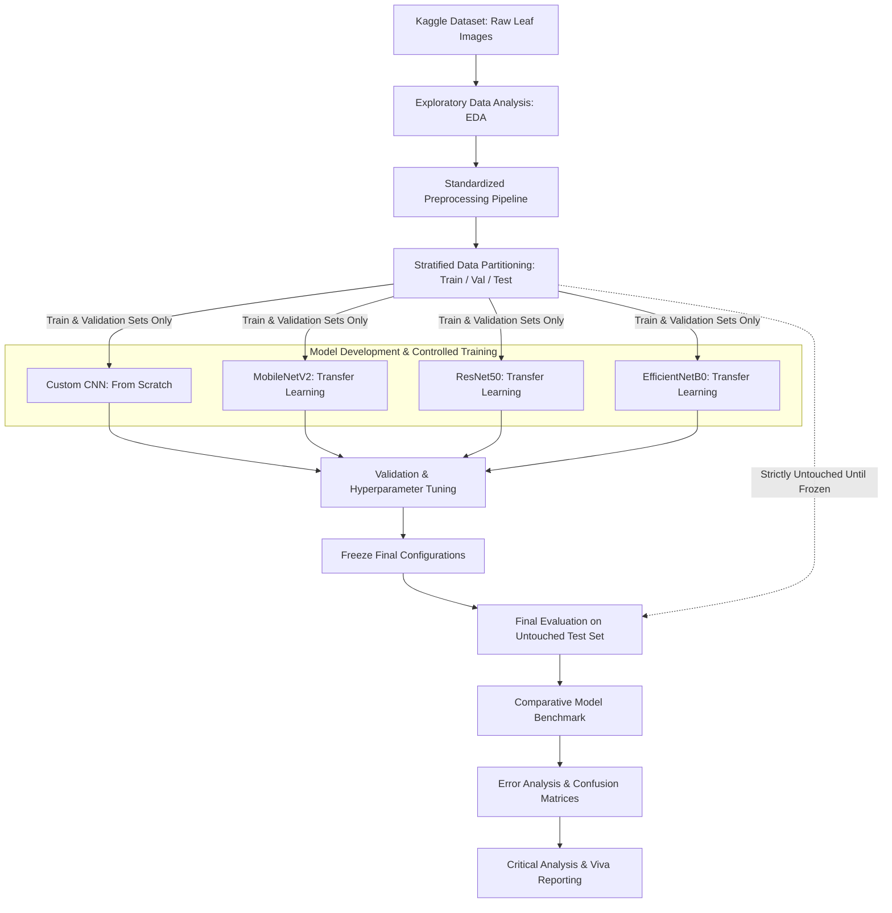
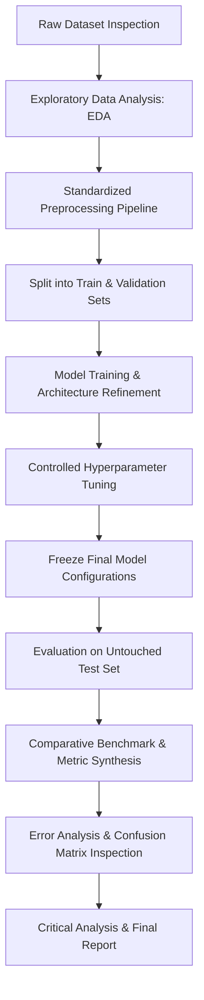
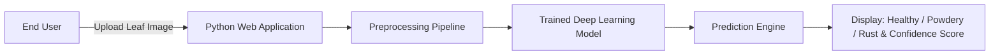

# Comparative Analysis of Deep Learning Architectures for Plant Disease Classification Using Leaf Images

> **Short Name:** Plant Disease Recognition Using Deep Learning  
> **Project Type:** Supervised Image Classification  
> **Target Classes:** `Healthy`, `Powdery`, `Rust`

---

## 1. Project Title & Overview

### Research Question
> *"Which deep-learning architecture provides the best balance between classification performance, generalization, and computational efficiency for plant disease recognition?"*

### Project Description
This project investigates the automated identification of plant foliar diseases from RGB leaf images using supervised deep learning. Plant diseases such as powdery mildew and rust significantly impact agricultural yield, food security, and economic stability. Early, precise detection through automated computer vision offers an effective, scalable pathway for modern agricultural monitoring.

To address our core research question, we conduct a rigorous, controlled comparative study of four distinct convolutional neural network architectures:
1. **Custom CNN** (constructed from scratch as an empirical baseline)
2. **MobileNetV2** (lightweight, depthwise-separable architecture via transfer learning)
3. **ResNet50** (deep residual learning architecture via transfer learning)
4. **EfficientNetB0** (compound-scaled architecture via transfer learning)

All four models are evaluated under a standardized experimental protocol on a Kaggle Plant Disease Recognition dataset across three target categories: **Healthy**, **Powdery** (Powdery Mildew), and **Rust**.

---

## 2. Project Objectives

1. **Investigate and understand the plant disease image dataset:** Audit data distribution, image resolutions, formats, and potential artifacts.
2. **Perform exploratory data analysis (EDA):** Quantify class balance, inspect sample images, and evaluate intra-class visual variations.
3. **Develop a reproducible image preprocessing pipeline:** Establish standardized resizing, normalization, and augmentation protocols with strict leakage prevention.
4. **Build a Custom CNN from scratch:** Construct, train, and optimize a convolutional network without external weights.
5. **Implement MobileNetV2 using transfer learning:** Adapt a pretrained MobileNetV2 backbone for edge-oriented classification.
6. **Implement ResNet50 using transfer learning:** Adapt a deep residual architecture to assess representation depth and feature extraction.
7. **Implement EfficientNetB0 using transfer learning:** Adapt a compound-scaled network balancing parameter efficiency and predictive power.
8. **Evaluate all four models using consistent metrics:** Assess performance uniformly across validation and test sets using standardized quantitative metrics.
9. **Compare predictive performance, generalization, model complexity, and computational cost:** Benchmark accuracy, F1-score, parameter count, floating-point operations, and inference latency.
10. **Perform error analysis:** Visually and statistically inspect misclassifications, boundary cases, and common failure modes.
11. **Document limitations and possible improvements:** Articulate practical constraints, domain shift challenges, and future deployment recommendations.

---

## 3. Technology Stack

| Technology | Purpose |
| :--- | :--- |
| **Python** | Main programming language |
| **TensorFlow** | Deep learning framework |
| **Keras** | Model development and training |
| **NumPy** | Numerical and tensor operations |
| **Pandas** | Dataset metadata and experiment result analysis |
| **Pillow** | Image loading, verification, and processing |
| **Matplotlib** | Data visualization, loss curves, and image inspection |
| **Scikit-learn** | Evaluation metrics, confusion matrices, and data splits |
| **Jupyter Notebook** | Interactive experimentation, prototyping, and documentation |
| **Git** | Distributed version control |
| **GitHub** | Team collaboration, code reviews, and source-code management |

---

## 4. Project Architecture

The project operates under a strictly controlled experimental protocol to ensure that model comparisons are fair, reproducible, and unbiased.



### Controlled Experimental Protocol
- All four models train on identical training partitions and are validated against identical validation splits.
- Pretrained backbones utilize ImageNet weights with standardized classification heads.
- Hyperparameter tuning (learning rate, dropout, optimizer, batch size) follows a unified logging framework.
- The test set remains completely untouched until final model configurations are frozen.

---

## 5. Repository Structure

```
plant-disease-classification/
│
├── .gitignore                          # Git exclusion rules for local environments, data, and model weights
├── README.md                           # Comprehensive project documentation
├── requirements.txt                    # Project dependencies and pinned library versions
│
├── dataset/                            # Local image dataset directory (git-ignored)
│
├── notebooks/                          # Sequential experimental notebooks
│   ├── 01_EDA.ipynb                    # [Existing] Exploratory data analysis & image distribution
│   ├── 02_Preprocessing.ipynb          # [Existing] Pipeline development & data loader validation
│   ├── 03_Custom_CNN.ipynb             # [Existing] Custom CNN architecture design & baseline training
│   ├── 04_MobileNetV2.ipynb            # [Existing] MobileNetV2 transfer learning & fine-tuning
│   ├── 05_ResNet50.ipynb               # [Existing] ResNet50 transfer learning & residual feature extraction
│   ├── 06_EfficientNetB0.ipynb         # [Existing] EfficientNetB0 compound scaling implementation
│   ├── 07_Hyperparameter_Tuning.ipynb  # [Planned] Systematic tuning experiments & comparison
│   ├── 08_Final_Evaluation.ipynb       # [Planned] Evaluation on untouched test partition
│   └── 09_Model_Comparison.ipynb       # [Planned] Global metrics synthesis & error analysis
│
├── src/                                # Modular, reusable Python package code
│   ├── preprocessing/                  # Data loaders, augmentation pipelines, and resizing utils
│   ├── models/                         # Model architecture definitions and factory functions
│   ├── training/                       # Training loops, loss functions, callbacks, and schedulers
│   └── evaluation/                     # Metrics computation, confusion matrix plots, and reporting
│
├── models/                             # [Planned storage] Serialized model weights & best checkpoints (git-ignored)
├── results/                            # [Planned storage] Exported evaluation CSVs and performance summaries
├── figures/                            # [Planned storage] Generated loss curves, confusion matrices, and plots
│
└── app/                                # [Planned] Optional inference application / interactive demonstration
```

### Folder Explanations
- **`dataset/`**: Local storage for downloaded leaf images organized into class or partition subfolders. This folder is ignored by Git to avoid tracking large binary files.
- **`notebooks/`**: Interactive Jupyter notebooks documenting each phase from exploratory data analysis to final comparison. Notebooks `01` through `06` are created; notebooks `07` through `09` are planned for upcoming milestones.
- **`src/`**: Modular, reusable Python modules imported into notebooks and scripts to avoid duplicate code across team members.
- **`models/`**: Local destination for serialized `.keras` or `.weights.h5` model files. Ignored by Git.
- **`results/`**: Output directory for quantitative metrics, tabular experiment logs, and test performance summaries.
- **`figures/`**: Generated graphical assets including training curves, ROC plots, sample predictions, and confusion matrices.
- **`app/`**: Optional web or GUI inference module (e.g., Streamlit demo) planned for development once core research milestones are completed.

---

## 6. Prerequisites

Every team member must ensure the following tooling is available on their local workstation:
- **Git**: Distributed version control ([git-scm.com](https://git-scm.com/))
- **Python 3.x**: Standard Python runtime (Python 3.9 to 3.11 is recommended for TensorFlow compatibility)
- **pip**: Python package installer (bundled with standard Python installations)
- **Jupyter**: JupyterLab or Jupyter Notebook ecosystem for interactive computation
- **GitHub Account**: Required for pushing feature branches and creating pull requests
- **Code Editor / IDE**: VS Code, Antigravity IDE, or PyCharm configured with Python extensions
- **Internet Connection**: Required for package installation and downloading the Kaggle dataset

> **Recommendation:** A Python virtual environment must be used to isolate project dependencies and avoid library conflicts across different operating systems.

---

## 7. Clone the Repository

Open your terminal (macOS/Linux) or Command Prompt/PowerShell (Windows) and clone the repository:

```bash
git clone <REPOSITORY_URL>
cd plant-disease-classification
```

---

## 8. Create Virtual Environment

Create and activate an isolated virtual environment named `venv` inside the project root directory.

### macOS / Linux
```bash
python3 -m venv venv
source venv/bin/activate
```

### Windows (Command Prompt)
```cmd
python -m venv venv
venv\Scripts\activate.bat
```

### Windows (PowerShell)
```powershell
python -m venv venv
venv\Scripts\Activate.ps1
```

Once activated, your terminal prompt will display the environment prefix:
```text
(venv)
```

> **Important:** The `venv/` folder contains local runtime files and binaries. It must **never** be committed to GitHub. Verify that `venv/` is active in `.gitignore`.

---

## 9. Install Dependencies

Upgrade `pip` and install all required packages listed in `requirements.txt`:

```bash
python -m pip install --upgrade pip
pip install -r requirements.txt
```

*Note: The project leader maintains and updates `requirements.txt`. If requirements need additions or revisions, discuss them with the team before updating the file.*

### Verify Installation
Run the following verification commands to confirm all primary dependencies load correctly:

```bash
python -c "import tensorflow as tf; print('TensorFlow version:', tf.__version__)"
python -c "import numpy as np; print('NumPy version:', np.__version__)"
python -c "import pandas as pd; print('Pandas version:', pd.__version__)"
python -c "import PIL; print('Pillow version:', PIL.__version__)"
python -c "import matplotlib; print('Matplotlib version:', matplotlib.__version__)"
python -c "import sklearn; print('Scikit-learn version:', sklearn.__version__)"
```

Or verify all core libraries simultaneously:
```bash
python -c "import tensorflow, numpy, pandas, PIL, matplotlib, sklearn; print('All core libraries verified successfully!')"
```

---

## 10. Jupyter Kernel Setup

To ensure notebooks execute within your virtual environment and resolve all installed packages, register the virtual environment as a dedicated Jupyter kernel:

```bash
pip install ipykernel
python -m ipykernel install --user --name plant-disease-env --display-name "Python (Plant Disease)"
```

### Selecting the Kernel:
1. Launch Jupyter Notebook or open any `.ipynb` file in your IDE (VS Code, Antigravity, PyCharm).
2. Click the **Kernel / Python Environment** selector in the top-right corner.
3. Select **Python (Plant Disease)** from the list of available kernels.

---

## 11. Dataset Setup

Due to file size and licensing guidelines, the raw dataset is **not committed to the Git repository**.

```text
DATASET SOURCE: [ADD VERIFIED KAGGLE URL HERE]
```

Every team member must download the identical dataset archive from the verified source URL above and extract it into the local `dataset/` directory.

### Expected Directory Structure
Once extracted, verify the dataset structure on disk:

```text
dataset/
├── train/
│   ├── Healthy/
│   ├── Powdery/
│   └── Rust/
├── validation/
│   ├── Healthy/
│   ├── Powdery/
│   └── Rust/
└── test/
    ├── Healthy/
    ├── Powdery/
    └── Rust/
```

*(Note: The actual downloaded structure supplied by the dataset must be verified during EDA in `01_EDA.ipynb`. If the dataset arrives unpartitioned or in a different layout, the standardized split protocol will be generated programmatically).*

---

## 12. Dataset Rules

To maintain scientific integrity and reproducible results across all team members:
1. **Never modify original images manually:** Do not crop, rename, color-correct, or alter raw files on disk.
2. **No personal or external images:** Do not introduce external leaf images into the official dataset.
3. **No selective image deletion:** Do not manually delete difficult or ambiguous images to artificially boost accuracy.
4. **Strict partition segregation:** Never mix training, validation, or test images.
5. **No data leakage into preprocessing:** Normalization parameters and architectural decisions must never incorporate information from the test set.
6. **Strictly untouched test set:** The test split must remain completely unseen until the final, frozen evaluation stage.
7. **Uniformity across the team:** All members must use the identical dataset version, partitioning scheme, and class mappings.

---

## 13. First Run

Follow this execution order when setting up the project for the first time:

1. **Activate virtual environment:** Ensure `(venv)` is displayed in your terminal.
2. **Install requirements:** Execute `pip install -r requirements.txt`.
3. **Verify TensorFlow:** Confirm TensorFlow is operational with `python -c "import tensorflow as tf; print(tf.__version__)"`.
4. **Set up Jupyter kernel:** Register and select `Python (Plant Disease)`.
5. **Download & extract dataset:** Place images inside the `dataset/` folder.
6. **Verify dataset structure:** Inspect class folders and directory layouts.
7. **Open `notebooks/01_EDA.ipynb`:** Execute exploratory data analysis to verify image shapes and class distributions.
8. **Inspect preprocessing:** Run `notebooks/02_Preprocessing.ipynb` to validate data loading and augmentation pipelines.
9. **Proceed to model development:** Train models according to assigned individual responsibilities.

---

## 14. Experiment Workflow

All modeling efforts follow a sequential, controlled experimental protocol:



> **Critical Rule:** The test set must **never** be used to select the best model, guide architectural modifications, or tune hyperparameters. All selection and tuning decisions must rely strictly on validation set metrics.

---

## 15. Four Models

We investigate four architectures designed to represent distinct deep-learning paradigms:

| Model | Approach | Role | Description |
| :--- | :--- | :--- | :--- |
| **Custom CNN** | Training from scratch | Baseline | Multi-layer convolutional network designed to establish an empirical baseline without transfer learning. |
| **MobileNetV2** | Transfer learning | Lightweight architecture | Depthwise-separable convolutional network optimized for low-latency and resource-constrained environments. |
| **ResNet50** | Transfer learning | Deep residual architecture | 50-layer deep network utilizing residual shortcut connections to mitigate vanishing gradients and capture deep hierarchies. |
| **EfficientNetB0** | Transfer learning | Efficient modern architecture | Compound-scaled network balancing depth, width, and resolution for high parameter efficiency. |

### Transfer-Learning Procedure
For MobileNetV2, ResNet50, and EfficientNetB0:
- Pretrained backbones are initialized with ImageNet weights.
- **Stage 1 (Frozen Backbone):** Base feature extractors are initially frozen; only custom classification heads (GlobalAveragePooling2D, Dropout, Dense with Softmax) are trained.
- **Stage 2 (Optional Fine-Tuning):** If empirically justified by validation performance, top layers of the backbone are unfrozen and trained at a substantially reduced learning rate to adapt domain-specific leaf texture features.

---

## 16. Model-Specific Responsibilities

- **Custom CNN:**
  - Build an end-to-end convolutional architecture from scratch (Conv2D, BatchNormalization, MaxPooling2D, Dropout, Dense).
  - Systematically experiment with layer depth, filter counts, regularization, and learning rates.
  - Establish the baseline performance and compute structural complexity.
- **MobileNetV2:**
  - Load `tf.keras.applications.MobileNetV2` with ImageNet weights (excluding the top classification head).
  - Freeze the base model; attach and train an adapted classification head.
  - Fine-tune selected upper inverted residual blocks if justified, logging all decisions.
- **ResNet50:**
  - Load `tf.keras.applications.ResNet50` with ImageNet weights.
  - Follow the controlled transfer-learning procedure; systematically document frozen and unfrozen layers.
  - Monitor residual representations and track potential signs of overfitting.
- **EfficientNetB0:**
  - Load `tf.keras.applications.EfficientNetB0` with ImageNet weights.
  - Follow the controlled transfer-learning procedure; adhere to architecture-specific input preprocessing.
  - Document frozen vs. fine-tuned layer configurations and evaluate parameter efficiency.

---

## 17. Team Member Responsibilities

The project workload is shared across 4 university team members.

### Member 1 — 
- Overall experimental framework and methodology design.
- Oversight of dataset integrity and EDA validation.
- Definition of common preprocessing standards and evaluation protocols.
- Implementation and optimization of the **Custom CNN** baseline.
- Coordination of the final cross-model comparison and critical analysis.
- Final code integration, documentation oversight, and repository management.

### Member 2
- Implementation of the standardized preprocessing pipeline and data loaders (`src/preprocessing/`).
- Design and evaluation of data augmentation strategies.
- Implementation and fine-tuning of **MobileNetV2**.
- Documentation of preprocessing transformations and input pipelines.

### Member 3
- Implementation and fine-tuning of **ResNet50**.
- Centralized experiment tracking and documentation of hyperparameter runs.
- Cross-validation oversight to ensure fair, controlled experimental conditions across all models.
- Model serialization and checkpoint management.

### Member 4
- Implementation and fine-tuning of **EfficientNetB0**.
- Final evaluation pipeline support (`src/evaluation/`).
- Generation of confusion matrices, ROC curves, and performance visualizations (`figures/`).
- Error analysis coordination and failure case visual inspection.

> **Important:** Individual responsibilities indicate primary ownership, **not isolated knowledge**. Every team member must understand all four models, the preprocessing pipeline, and the comparative metrics in depth for the viva examination.

---

## 18. Git Workflow for Team Members

To ensure smooth collaboration and prevent merge conflicts, follow this standardized Git procedure:

### 1. Update Main Before Starting Work
```bash
git checkout main
git pull origin main
```

### 2. Create a Feature Branch
```bash
git checkout -b feature/<task-name>
# Example:
git checkout -b feature/custom-cnn
```

### 3. Make Incremental, Meaningful Commits
Avoid giant end-of-day commits. Commit small, logical units of work with clear commit messages:
```bash
git status
git add notebooks/03_Custom_CNN.ipynb
git commit -m "Implement Custom CNN baseline architecture"
```

### 4. Push Branch and Open a Pull Request
```bash
git push -u origin feature/<task-name>
```
Open a Pull Request on GitHub for review before merging into `main`.

*Note: If the team leader coordinates direct commits to `main` for specific collaborative tasks, members must always execute `git pull origin main` immediately before pushing.*

---

## 19. Important Git Rules

To prevent repository bloat, merge conflicts, and security leaks, strictly adhere to the following:

**NEVER commit the following to Git:**
- Virtual environment directories: `venv/`, `.venv/`, `env/`
- Raw or processed image datasets: `dataset/`, `*.jpg`, `*.png`
- Model weight files and checkpoints: `*.h5`, `*.keras`, `*.weights.h5`, `models/`
- API keys, credentials, tokens, or `.env` files
- Temporary OS files: `.DS_Store`, `Thumbs.db`
- Jupyter checkpoint directories: `.ipynb_checkpoints/`
- Python cache files and bytecode: `__pycache__/`, `*.pyc`

Verify your `.gitignore` configuration before staging files.

---

## 20. Experiment Logging

Every meaningful experiment must be systematically logged to guarantee reproducibility. Record the following parameters for every training iteration:

- **Experiment ID**: e.g., `EXP-01-CNN`, `EXP-04-RESNET`
- **Model**: Custom CNN, MobileNetV2, ResNet50, or EfficientNetB0
- **Learning Rate**: Initial rate, scheduler type, decay factors
- **Batch Size**: e.g., 16, 32, 64
- **Epochs**: Maximum epochs and early stopping epoch
- **Dropout Rate**: Regularization parameters (e.g., 0.2, 0.5)
- **Optimizer**: e.g., Adam (with $\beta_1, \beta_2$), RMSprop, SGD
- **Data Augmentation**: Specific transforms enabled (rotation, zoom, flips)
- **Backbone State**: Frozen, partial unfreeze (specify layer indices), or scratch
- **Validation Accuracy**: Best validation accuracy
- **Validation Precision**: Macro/Weighted precision
- **Validation Recall**: Macro/Weighted recall
- **Validation F1-Score**: Macro/Weighted harmonic mean
- **Training Time**: Wall-clock time per epoch and total elapsed duration
- **Qualitative Observations**: Convergence speed, signs of overfitting, or loss instability

---

## 21. Evaluation Metrics

To provide an exhaustive assessment beyond raw classification accuracy, all models are evaluated across the following metrics:

1. **Accuracy**: Overall proportion of correctly classified leaf samples.
2. **Precision (Macro & Weighted)**: Proportion of true positive disease detections among all positive predictions, evaluating false alarm rates.
3. **Recall (Macro & Weighted)**: Proportion of true positive disease detections identified among all actual disease instances, assessing disease miss rates.
4. **F1-Score (Macro & Weighted)**: Harmonic mean of precision and recall, balancing false positives and false negatives.
5. **Confusion Matrix**: Tabulation of true vs. predicted classes to identify specific pairs of confused classes (e.g., Healthy vs. Powdery).
6. **ROC-AUC (One-vs-Rest)**: Area under the receiver operating characteristic curve across classification thresholds.
7. **Model Parameters**: Total parameter count vs. Trainable parameter count, measuring architectural footprint.
8. **Computational Efficiency**: Training time per epoch and average inference latency per image (ms).
9. **Generalization Gap**: Divergence between training metrics and validation/test metrics as an indicator of overfitting.

### Why Multiple Metrics Are Necessary
In agricultural plant pathology, a false negative (classifying a diseased Rust leaf as Healthy) can lead to crop devastation, while a false positive incurs unnecessary treatment costs. Relying solely on overall accuracy can mask critical class-specific weaknesses, particularly when classes exhibit subtle visual differences.

---

## 22. Error Analysis

Upon completing evaluation on the test partition, the team will systematically inspect misclassified images to diagnose failure modes:
- **Visual symptom similarity**: Early-stage rust or subtle powdery spots that resemble healthy leaf variations.
- **Lighting and exposure conditions**: Overexposed glare, harsh shadows, or uneven field illumination.
- **Background complexity**: Soil, fingers, netting, or background foliage interfering with leaf contours.
- **Leaf orientation & occlusion**: Partial leaf visibility, curled leaves, or folded surfaces.
- **Image quality & resolution**: Motion blur, compression artifacts, or out-of-focus captures.
- **Disease severity**: Micro-lesions versus widespread necrotic patches.
- **Potential dataset bias**: Systematic artifacts present in training images that fail to transfer to real-world test samples.

*Note: Findings and insights will be documented following empirical evaluation without fabricating premature conclusions.*

---

## 23. Final Model Comparison

The final comparison will be populated exclusively from experimental test set results using the standardized template below:

| Model | Accuracy | Precision (Macro) | Recall (Macro) | F1-Score (Macro) | Total Parameters | Trainable Parameters | Inference Latency (ms) | Notes |
| :--- | :---: | :---: | :---: | :---: | :---: | :---: | :---: | :--- |
| **Custom CNN** | *TBD* | *TBD* | *TBD* | *TBD* | *TBD* | *TBD* | *TBD* | Baseline model trained from scratch |
| **MobileNetV2** | *TBD* | *TBD* | *TBD* | *TBD* | *TBD* | *TBD* | *TBD* | Lightweight transfer learning |
| **ResNet50** | *TBD* | *TBD* | *TBD* | *TBD* | *TBD* | *TBD* | *TBD* | Deep residual network |
| **EfficientNetB0** | *TBD* | *TBD* | *TBD* | *TBD* | *TBD* | *TBD* | *TBD* | Compound scaling architecture |

*Note: Results will be populated after executing `notebooks/08_Final_Evaluation.ipynb` and `notebooks/09_Model_Comparison.ipynb`.*

---

## 24. Website / Demo (Optional)

An interactive demonstration interface is an **optional extension** that will only be developed after all core research, model training, and critical evaluations are fully completed.

### Proposed Architecture


### Recommended Framework
If implemented, **Streamlit** is the recommended framework due to its lightweight Python-native structure, rapid prototyping capability, and minimal operational overhead.

> **Important:** The optional web application does not replace or compensate for rigorous experimental analysis, error diagnosis, and documentation.

---

## 25. Reproducibility Checklist

Before final project submission and viva presentation, all team members must verify:
- [ ] Identical dataset version verified and used by all members.
- [ ] Preprocessing transformations, image dimensions, and normalizations standardized.
- [ ] Label encoding and class index mappings aligned (`Healthy`, `Powdery`, `Rust`).
- [ ] Random seeds fixed for split partitions and weight initialization where applicable.
- [ ] Hyperparameters, learning rate schedules, and epoch counts documented.
- [ ] Final model architectures and freeze/unfreeze points recorded.
- [ ] `requirements.txt` updated to reflect exact installed dependencies.
- [ ] `README.md` updated with finalized project details.
- [ ] Test partition kept completely untouched until final model freezing.
- [ ] Quantitative metric logs exported and stored in `results/`.
- [ ] Confusion matrices, loss plots, and sample error images saved in `figures/`.
- [ ] Git commit history reflects collaborative, incremental contributions.
- [ ] All four team members understand every model and phase for the oral viva.

---

## 26. Development Roadmap

- **PHASE 1 — Foundation**
  - Initialize Git repository, branch policies, and collaboration norms.
  - Configure virtual environment and install core libraries.
  - Establish directory structure and `.gitignore` boundaries.
  - Align team members on responsibilities and experimental workflow.
- **PHASE 2 — Dataset & EDA**
  - Download and verify the Kaggle dataset.
  - Inspect sample images and examine class distributions.
  - Audit image dimensions, color profiles, and quality.
  - Screen for duplicates, mislabeled items, or corrupted images.
- **PHASE 3 — Preprocessing**
  - Implement standardized resizing, normalization, and channel formatting.
  - Design training augmentation routines (rotations, flips, zooming).
  - Construct reusable data loader pipelines.
  - Enforce data leakage safeguards between partitions.
- **PHASE 4 — Model Development**
  - Construct and train the Custom CNN baseline from scratch.
  - Implement MobileNetV2 with ImageNet weights and custom classification head.
  - Implement ResNet50 with ImageNet weights.
  - Implement EfficientNetB0 with ImageNet weights.
- **PHASE 5 — Experiments & Hyperparameter Tuning**
  - Execute controlled tuning across learning rates, batch sizes, and dropout rates.
  - Evaluate regularization impacts and learning rate schedules.
  - Compare validation performance across all four architectures.
- **PHASE 6 — Final Evaluation**
  - Freeze best model weights and hyperparameters.
  - Perform one-time evaluation on the untouched test partition.
  - Compute accuracy, precision, recall, F1, ROC-AUC, and parameter counts.
  - Generate comprehensive confusion matrices and performance plots.
- **PHASE 7 — Critical Analysis**
  - Perform error analysis on misclassified leaf images.
  - Quantify generalization gap, overfitting, and underfitting behaviors.
  - Benchmark computational latency, parameter footprint, and resource tradeoffs.
  - Document domain-specific limitations and potential real-world improvements.
- **PHASE 8 — Finalization**
  - Compile academic report and methodology write-up.
  - Finalize GitHub repository, code cleanliness, and documentation.
  - Prepare presentation slides and demonstration materials.
  - Conduct mock viva sessions ensuring all members master every architecture.

---

## 27. Troubleshooting

Common setup and runtime issues with recommended solutions:

- **TensorFlow Not Importing or Failing on Import:**
  - *Cause:* Virtual environment is not activated or wrong Python binary is executing.
  - *Resolution:* Confirm activation with `which python` (macOS/Linux) or `where python` (Windows). Reinstall TensorFlow via `pip install tensorflow`.
- **Wrong Python Interpreter Selected:**
  - *Cause:* Editor defaults to global system Python.
  - *Resolution:* In VS Code or your IDE, press `Cmd/Ctrl + Shift + P` -> `Python: Select Interpreter` -> choose the path pointing to `./venv/bin/python` (or `.\venv\Scripts\python.exe`).
- **Jupyter Notebook Cannot Find Environment:**
  - *Cause:* The `ipykernel` package was not installed or registered inside the virtual environment.
  - *Resolution:* Activate `venv`, install `ipykernel`, and register the kernel:
    ```bash
    python -m ipykernel install --user --name plant-disease-env --display-name "Python (Plant Disease)"
    ```
- **Out of Memory (OOM) Errors During Training:**
  - *Cause:* Batch size or image dimensions exceed GPU/CPU RAM capacity.
  - *Resolution:* Reduce batch size in your data loader (e.g., from 64 to 32 or 16) and confirm input image dimensions match target architecture specs.
- **Dataset Path Errors:**
  - *Cause:* Relative path discrepancy depending on whether code runs from project root or inside `notebooks/`.
  - *Resolution:* Use path resolution relative to project root or use absolute paths via Python's `pathlib.Path(__file__).resolve()` or `os.path.abspath`.
- **Git Accidentally Tracking Dataset or Large Weights:**
  - *Cause:* Files were added before `.gitignore` was configured.
  - *Resolution:* Untrack cached files without deleting them from local disk:
    ```bash
    git rm -r --cached dataset/
    git commit -m "Untrack dataset directory"
    ```

---

## 28. Team Rules

1. **Consensus on Data Changes:** Do not modify, repartition, or alter the dataset without unanimous team agreement.
2. **Standardized Preprocessing:** Do not alter preprocessing parameters independently when running comparative benchmarks.
3. **Purity of Test Data:** Never train, tune, or make architectural decisions using the test partition.
4. **Diligent Experiment Logging:** Record all hyperparameter values, configurations, and results for every training run.
5. **Pull Before Working:** Always execute `git pull origin main` prior to commencing any development work.
6. **Meaningful Git Commits:** Write concise, explanatory commit messages describing specific modifications.
7. **Clean & Documented Code:** Maintain readable code with descriptive variable names and clear docstrings.
8. **Security & Cleanliness:** Never commit secrets, credentials, temporary data, or serialized model files.
9. **Transparent Communication:** Communicate all major experimental deviations and parameter alterations promptly.
10. **Collective Mastery:** Every team member must understand all four architectures, preprocessing steps, and evaluation metrics for the viva examination.

---

## 29. Current Status

- [x] Repository created
- [x] Initial project structure created
- [x] .gitignore created
- [ ] requirements.txt finalized
- [ ] Dataset verified
- [ ] EDA completed
- [ ] Preprocessing completed
- [ ] Custom CNN completed
- [ ] MobileNetV2 completed
- [ ] ResNet50 completed
- [ ] EfficientNetB0 completed
- [ ] Hyperparameter experiments completed
- [ ] Final test evaluation completed
- [ ] Model comparison completed
- [ ] Error analysis completed
- [ ] Critical analysis completed
- [ ] Report completed
- [ ] Presentation completed
- [ ] Video completed
- [ ] Viva preparation completed

---

**Project Status: In Development**

Dataset Source: [ADD VERIFIED DATASET URL]  
GitHub Repository: [ADD REPOSITORY URL]
